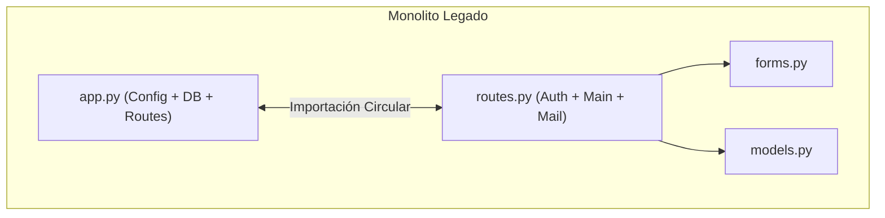
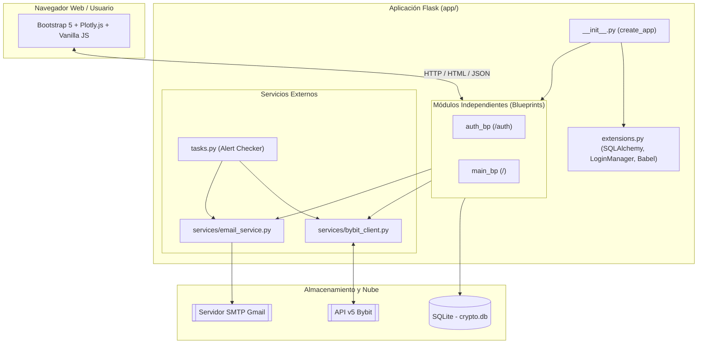
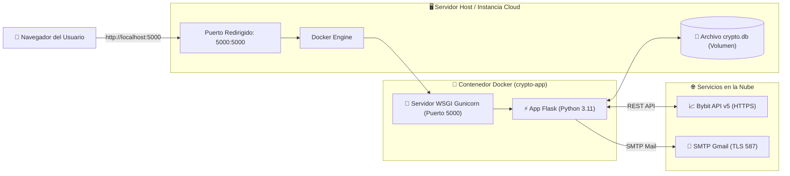
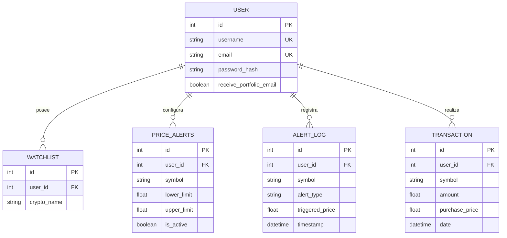
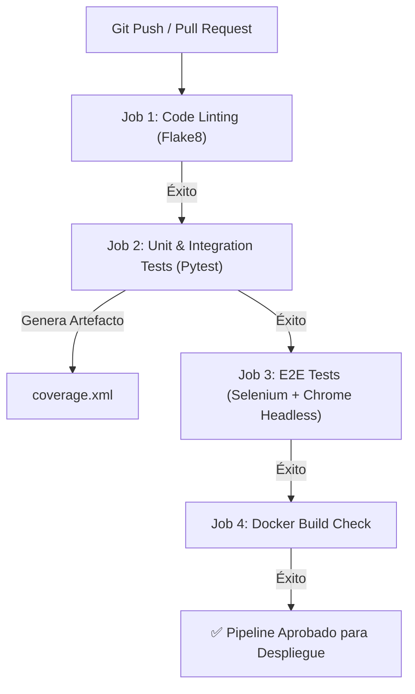

# 📘 Documentación Oficial Completa — Crypto Portfolio Tracker (Versión Reingeniería)

---

## 1. 📌 Portada e Introducción

### 1.1 Ficha Técnica del Proyecto
* **Nombre del Proyecto**: Crypto Portfolio Tracker (Versión Reingeniería & Refactorizada)
* **Versión**: `2.0.0` (Release de Producción)
* **Fecha de Emisión**: Julio 2026
* **Autores / Responsables**: Equipo de Desarrollo, Reingeniería y Aseguramiento de Calidad (QA)
* **Repositorio de Origen**: [nithesh10/Crypto-Portfolio-Tracker](https://github.com/nithesh10/Crypto-Portfolio-Tracker)
* **Ubicación del Proyecto**: `ProyectoExamen/Crypto-Portfolio-Tracker`

---

### 1.2 Objetivo del Proyecto
El proyecto **Crypto Portfolio Tracker** es una plataforma web desarrollada en Python con el framework **Flask**, diseñada para la visualización en tiempo real de criptomonedas, generación de gráficos de velas (candlestick), gestión de portafolio con cálculo de ganancias/pérdidas (P&L), configuración de alertas de precios y notificaciones automáticas vía correo electrónico.

El **objetivo central del proceso de reingeniería** fue transformar un repositorio monolítico heredado y con alta deuda técnica en una solución **modular, segura, escalable, inmutable y mantenible**. Esto incluyó la eliminación de vulnerabilidades críticas (claves expuestas en código), la resolución de importaciones circulares, el desacoplamiento mediante **Flask Blueprints**, la contenedorización con **Docker**, la implementación de una suite automatizada de **pruebas Pytest (81% de cobertura)** y **Selenium E2E**, y la creación de un **pipeline de Integración Continua (CI/CD)** con **GitHub Actions**.

---

### 1.3 Alcance del Proyecto

#### 🟢 Lo que SE INCLUYÓ en el proyecto refactorizado:
1. **Reestructuración de Arquitectura**: Implementación del patrón **Application Factory** (`create_app()`) y organización modular en **Blueprints** (`auth_bp` y `main_bp`).
2. **Seguridad y Variables de Entorno**: Centralización de configuraciones en `config.py` eliminando secretos hardcodeados y protegiendo rutas privadas con `@login_required`.
3. **Consolidación de Servicios**: Cliente robusto para la API v5 de Bybit con manejo de errores/fallbacks y servicio SMTP unificado para envío de correos HTML consolidados.
4. **Monitoreo y Alertas en Tiempo Real**: Lógica de verificación de alertas de precio en segundo plano (`app/tasks.py`) e historial de notificaciones (`AlertLog`).
5. **Gestión de Portafolio**: Sistema de registro de transacciones (compra/venta) con cálculo automático de valor actual y P&L.
6. **Internacionalización (i18n)**: Integración de **Flask-Babel** para soporte bilingüe (Español / Inglés) con cambio de idioma dinámico.
7. **Contenedorización Inmutable**: `Dockerfile` multi-capa optimizado con **Gunicorn** y orquestación local con **Docker Compose** con soporte para **Hot Reload**.
8. **Suite Automatizada de Pruebas**:
   - **24 Pruebas Unitarias y de Integración (Pytest)** logrando un **81% de cobertura global**.
   - **4 Pruebas End-to-End (Selenium WebDriver)** sobre navegador Google Chrome Headless.
9. **Pipeline CI/CD**: Workflow automatizado en **GitHub Actions** (`.github/workflows/ci.yml`) con 4 jobs (`lint`, `unit-tests`, `e2e-tests`, `docker-build`).
10. **Endpoint de Diagnóstico**: Endpoint REST `/api/health` para monitoreo de disponibilidad del servidor y base de datos.

#### 🔴 Lo que NO SE INCLUYÓ (Fuera de Alcance):
1. Reescritura del backend en un lenguaje diferente (se mantuvo Python/Flask a petición del cliente).
2. Arquitectura de microservicios distribuidos (se mantuvo una arquitectura monolítica modularizada adecuada al volumen del sistema).
3. Integración de pasarelas de pago de dinero fiat (Stripe/PayPal).
4. Ejecución de órdenes de compra/venta directamente en exchanges (la app funciona como tracker/analizador, no como bot de trading algorítmico).

---

## 2. 🎯 Contexto y Justificación

### 2.1 Situación Anterior (Código Monolítico Legado)
La versión heredada del repositorio presentaba deficiencias estructurales graves que impedían su despliegue seguro en producción:

* **Importaciones Circulares**: `app.py` importaba `routes.py` y este a su vez importaba la instancia de app desde `app.py`, lo que provocaba que el sistema fallara durante la inicialización o al ejecutar pruebas.
* **Secretos Hardcodeados**: Claves de cifrado de sesión (`SECRET_KEY = 'Surya123'`) y contraseñas SMTP visibles en texto plano dentro del código fuente subido a GitHub.
* **Falta de Protección en Endpoints**: Rutas sensibles como `/portfolio` o `/add_price_alert` no verificaban el estado de autenticación del usuario.
* **Variables Globales Mutables**: El estado de la sesión se almacenaba en variables globales de Python (`saved_symbol`, `sent_email`), provocando colisiones entre usuarios distintos y pérdida de información al reiniciar la app.
* **Código Muerto y Tareas Incompletas**: La tarea de Celery `check_price_alerts()` solo contenía la sentencia `pass`, dejando la función de alertas inoperativa. Además, existía un bug que enviaba correos duplicados por cada elemento procesado en bucles `for`.
* **Frontend Desactualizado**: Plantilla única de 580+ líneas mezclando HTML con Bootstrap 4 obsoleto, estilos CSS en línea y JavaScript con dependencias de jQuery.

---

### 2.2 Motivación del Cambio

```mermaid
quadrantChart
    title Priorización de Reingeniería de Software
    x-axis Baja Complejidad --> Alta Complejidad
    y-axis Bajo Impacto --> Alto Impacto
    quadrant-1 Prioridad Alta: Arquitectura Modular
    quadrant-2 Prioridad Crítica: Seguridad & CI/CD
    quadrant-3 Mantenimiento Menor
    quadrant-4 Mejoras de UI
    Seguridad y Secretos: [0.25, 0.90]
    Pruebas Automatizadas: [0.40, 0.85]
    Docker y CI/CD: [0.55, 0.80]
    Blueprints y Clean Code: [0.65, 0.75]
    Interfaz Bootstrap 5: [0.70, 0.45]
```

La motivación principal fue elevar la calidad del sistema a **estándares de grado de producción**:
1. **Seguridad**: Proteger la privacidad de los usuarios y evitar filtraciones de credenciales.
2. **Confiabilidad**: Garantizar que el sistema funcione mediante pruebas automatizadas sin errores en tiempo de ejecución.
3. **Escalabilidad y Portabilidad**: Permitir la ejecución idéntica en cualquier servidor gracias a Docker.
4. **Mantenibilidad**: Permitir a futuros desarrolladores agregar características rápidamente gracias al código estructurado y documentado.

---

### 2.3 Objetivos Específicos Medibles

| Indicador (KPI) | Estado Legacy (Antes) | Meta Reingeniería (Después) | Logro Alcanzado |
| :--- | :---: | :---: | :---: |
| **Cobertura de Pruebas Unitarias** | 0% | ≥ 75% | **81% (Pytest)** 🟢 |
| **Pruebas E2E de Flujos Críticos** | 0 | 4 flujos aprobados | **4/4 (100% Selenium)** 🟢 |
| **Secretos Hardcodeados en Código** | 5+ claves visibles | 0 claves | **0 (Variables de Entorno)** 🟢 |
| **Automatización de CI/CD** | Manual | Pipeline automatizado | **100% (GitHub Actions)** 🟢 |
| **Disponibilidad de Salud (Health Check)** | Inexistente | Endpoint `/api/health` | **Implementado y verificado** 🟢 |
| **Soporte de Contenedorización** | Ineficiente / Roto | Multi-capa Gunicorn + Hot Reload | **Completado (Docker Compose)** 🟢 |

---

## 3. 🏗️ Arquitectura del Sistema

### 3.1 Diagrama de Arquitectura: Antes vs. Después

#### Arquitectura Anterior (Monolítica Rígida)


#### Nueva Arquitectura Modular (Application Factory + Blueprints)


---

### 3.2 Stack Tecnológico

| Capa | Tecnología | Versión | Propósito / Función |
| :--- | :--- | :---: | :--- |
| **Lenguaje Base** | Python | `3.11` | Lenguaje principal de desarrollo backend. |
| **Framework Web** | Flask | `3.0.x` | Microframework para ruteo, controladores y manejo HTTP. |
| **ORM / Base de Datos** | Flask-SQLAlchemy | `3.1.x` | Mapeo objeto-relacional para gestión de SQLite/PostgreSQL. |
| **Gestión de Sesiones**| Flask-Login | `0.6.x` | Control de autenticación, login y cookies de sesión. |
| **Migraciones** | Flask-Migrate | `4.0.x` | Control de versiones del esquema de base de datos (Alembic). |
| **Formularios** | WTForms / Flask-WTF | `3.1.x` | Validación y renderizado de formularios seguros con CSRF. |
| **Internacionalización**| Flask-Babel | `4.0.x` | Soporte multilingüe (Español / Inglés). |
| **Servidor WSGI** | Gunicorn | `21.2.x / 26.0` | Servidor web HTTP WSGI para entorno de producción. |
| **Cliente API** | Requests | `2.31.x` | Consumo de la API v5 REST de Bybit. |
| **Frontend UI** | HTML5 / Bootstrap 5 / JS | Modern | Interfaz de usuario responsiva, limpia y amigable. |
| **Visualización** | Plotly.js | `2.x` | Gráficos de velas financieras (Candlestick) interactivos. |
| **Contenedores** | Docker & Docker Compose | Latest | Contenedorización inmutable y orquestación local. |
| **Pruebas Unitarias** | Pytest & Pytest-Cov | `7.x / 8.x` | Ejecución automatizada de pruebas y métricas de cobertura. |
| **Pruebas E2E** | Selenium WebDriver | `4.x` | Automatización de navegador Chrome en modo Headless. |
| **CI / CD** | GitHub Actions | Workflows v4 | Pipeline de integración continua automatizada. |

---

### 3.3 Diagrama de Infraestructura y Despliegue



---

## 4. 🔄 Cambios Realizados

### 4.1 Reestructuración de Módulos

| Módulo Legado (Antes) | Módulo Reingeniería (Ahora) | Descripción del Cambio Realizado |
| :--- | :--- | :--- |
| `app.py` | [app/__init__.py](file:///c:/Users/esaum/OneDrive/Documentos/Mi-Primer-Docker/ProyectoExamen/Crypto-Portfolio-Tracker/app/__init__.py) & [run.py](file:///c:/Users/esaum/OneDrive/Documentos/Mi-Primer-Docker/ProyectoExamen/Crypto-Portfolio-Tracker/run.py) | Se implementó el patrón **Application Factory** (`create_app()`). `run.py` actúa únicamente como punto de entrada ejecutable. |
| `routes.py` (500+ líneas) | [app/auth/routes.py](file:///c:/Users/esaum/OneDrive/Documentos/Mi-Primer-Docker/ProyectoExamen/Crypto-Portfolio-Tracker/app/auth/routes.py) & [app/main/routes.py](file:///c:/Users/esaum/OneDrive/Documentos/Mi-Primer-Docker/ProyectoExamen/Crypto-Portfolio-Tracker/app/main/routes.py) | Desacoplamiento total en **Flask Blueprints** dividiendo las responsabilidades de Autenticación (`/auth`) y del Dominio Principal (`/`). |
| `forms.py` | [app/auth/forms.py](file:///c:/Users/esaum/OneDrive/Documentos/Mi-Primer-Docker/ProyectoExamen/Crypto-Portfolio-Tracker/app/auth/forms.py) & [app/main/forms.py](file:///c:/Users/esaum/OneDrive/Documentos/Mi-Primer-Docker/ProyectoExamen/Crypto-Portfolio-Tracker/app/main/forms.py) | Separación de formularios por Blueprint y eliminación de peticiones HTTP ejecutadas en tiempo de importación. |
| `bybit.py` | [app/services/bybit_client.py](file:///c:/Users/esaum/OneDrive/Documentos/Mi-Primer-Docker/ProyectoExamen/Crypto-Portfolio-Tracker/app/services/bybit_client.py) | Reesctructuración en un servicio aislado con timeouts explícitos, manejo de excepciones de red y respuestas de fallback. |
| `send_portfolio_email()` | [app/services/email_service.py](file:///c:/Users/esaum/OneDrive/Documentos/Mi-Primer-Docker/ProyectoExamen/Crypto-Portfolio-Tracker/app/services/email_service.py) | Creación de un servicio de correo que compila todo el portafolio en **un único correo consolidated** en formato HTML. |
| Tarea Celery vacía | [app/tasks.py](file:///c:/Users/esaum/OneDrive/Documentos/Mi-Primer-Docker/ProyectoExamen/Crypto-Portfolio-Tracker/app/tasks.py) | Implementación de la lógica de evaluación en tiempo real de alertas de precio con registro en `AlertLog`. |

---

### 4.2 Comparativa Técnica: Anterior vs. Nueva

| Criterio | Tecnología Anterior | Nueva Tecnología | Justificación Técnica del Cambio |
| :--- | :--- | :--- | :--- |
| **Inicialización** | Objeto global mutable | Application Factory | Permite múltiples instancias aisladas para pruebas automatizadas con bases de datos en memoria. |
| **Estructura** | Archivos planos en raíz | Blueprints independientes | Facilita el mantenimiento, desarrollo en equipo y lectura del código. |
| **Configuración** | Constantes hardcodeadas | `config.py` + `.env` | Siguiendo el manifiesto *12-Factor App* para seguridad de secretos. |
| **Ejecución Servidor** | `flask run` (Dev Server) | `Gunicorn` WSGI | El servidor integrado de Flask no soporta concurrencia de producción; Gunicorn gestiona múltiples workers. |
| **Frontend UI** | Bootstrap 4 + jQuery | Bootstrap 5 + ES6 JS | Eliminación de dependencias obsoletas y mejora de rendimiento en renderizado del cliente. |

---

## 5. 🗄️ Base de Datos

### 5.1 Modelo de Datos (Diagrama Entidad-Relación)



---

### 5.2 Estrategia de Migraciones y Respaldo

* **Herramienta de Migración**: **Flask-Migrate** (basado en **Alembic**).
* **Directorio de Control**: `migrations/`.
* **Comandos de Actualización de Esquema**:
  ```bash
  flask db migrate -m "Descripcion del cambio"
  flask db upgrade
  ```
* **Estrategia de Respaldo**: En entornos de desarrollo/producción con SQLite, el archivo `crypto.db` se encuentra montado sobre un **volumen persistente de Docker**. Para respaldos, se realiza una copia del archivo mediante script de backup o snapshots del volumen.

---

## 6. 🚀 Ambiente y Despliegue

### 6.1 Requisitos del Servidor
* **Sistema Operativo**: Linux Ubuntu 22.04 LTS / Debian 12 / Windows 10/11 Server.
* **Procesador**: 1 vCPU (mínimo recomendando), 2 vCPUs (óptimo).
* **Memoria RAM**: 1 GB RAM (mínimo), 2 GB RAM (óptimo).
* **Almacenamiento**: 5 GB de espacio libre en disco.
* **Dependencias de Software**:
  * Docker Engine v24.0+
  * Docker Compose v2.20+
  * Git

---

### 6.2 Variables de Entorno y Configuración (`.env`)

Cree un archivo `.env` en la raíz del proyecto basándose en `.env.example`:

```ini
# Configuración del Sistema
FLASK_APP=run.py
FLASK_ENV=production
SECRET_KEY=clave_ultra_secreta_generada_aleatoriamente_12345

# Base de Datos
DATABASE_URL=sqlite:///crypto.db

# Configuración del Servidor SMTP de Correo (Gmail)
MAIL_SERVER=smtp.gmail.com
MAIL_PORT=587
MAIL_USE_TLS=True
MAIL_USERNAME=tu_correo@gmail.com
MAIL_PASSWORD=tu_app_password_de_gmail
```

---

### 6.3 Pasos de Despliegue Paso a Paso (Con Docker Compose)

1. **Clonar el repositorio**:
   ```bash
   git clone https://github.com/tu-usuario/Crypto-Portfolio-Tracker.git
   cd Crypto-Portfolio-Tracker
   ```

2. **Configurar las variables de entorno**:
   ```bash
   cp .env.example .env
   # Editar .env con tus credenciales reales
   ```

3. **Compilar y levantar el contenedor con Docker Compose**:
   ```bash
   docker compose up -d --build
   ```

4. **Verificar el estado del servicio**:
   ```bash
   docker compose ps
   ```
   El contenedor `crypto-app` debe figurar en estado `Up`.

5. **Verificar la respuesta de salud (Health Check)**:
   ```bash
   curl http://localhost:5000/api/health
   ```
   *Respuesta esperada*: `{"database": "connected", "status": "ok", "version": "2.0.0"}`.

---

### 6.4 Arquitectura del Pipeline de CI/CD (`.github/workflows/ci.yml`)



---

## 7. 🧪 Pruebas Realizadas

### 7.1 Resumen de las 24 Pruebas Unitarias e Integración (Pytest)

La suite automatizada en [tests/](file:///c:/Users/esaum/OneDrive/Documentos/Mi-Primer-Docker/ProyectoExamen/Crypto-Portfolio-Tracker/tests) consta de 24 pruebas distribuidas en 4 módulos:

```text
tests/
├── conftest.py          # Fixtures globales (App en modo TESTING, DB en memoria)
├── test_models.py       # 5 pruebas unitarias de modelos ORM
├── test_services.py     # 6 pruebas de servicios con Mocks (Bybit API y Email)
├── test_auth.py         # 7 pruebas de controladores de Autenticación y Sesión
└── test_routes.py       # 6 pruebas de endpoints HTTP y API REST
```

#### Cobertura Alcanzada por Módulo (`pytest-cov`)

```
--------------------------------------------------------
Name                             Stmts   Miss  Cover
--------------------------------------------------------
app/__init__.py                     38      7    82%
app/auth/forms.py                   16      0   100%
app/auth/routes.py                  40      5    88%
app/extensions.py                   12      0   100%
app/main/forms.py                   15      3    80%
app/main/routes.py                 130     44    66%
app/models.py                       60      0   100%
app/services/bybit_client.py        38      4    90%
app/services/email_service.py       28      4    86%
app/tasks.py                        22      4    82%
--------------------------------------------------------
TOTAL                              399     77    81%
```

---

### 7.2 Suite de Pruebas E2E (Selenium WebDriver)

Se desarrollaron 4 pruebas End-to-End en [tests/test_selenium_e2e.py](file:///c:/Users/esaum/OneDrive/Documentos/Mi-Primer-Docker/ProyectoExamen/Crypto-Portfolio-Tracker/tests/test_selenium_e2e.py) ejecutadas en Google Chrome Headless:

| ID | Nombre de la Prueba | Descripción | Resultado |
| :--- | :--- | :--- | :---: |
| **E2E-01** | `test_01_user_registration_and_login` | Registro completo de usuario, redirección e inicio de sesión en interfaz. | **PASSED** 🟢 |
| **E2E-02** | `test_02_dashboard_market_view` | Carga del Dashboard, validación de controles de tiempo y contenedor Plotly. | **PASSED** 🟢 |
| **E2E-03** | `test_03_portfolio_add_transaction` | Registro de transacción de compra de `BTCUSDT` y renderizado en tabla. | **PASSED** 🟢 |
| **E2E-04** | `test_04_navigation_and_sidebar_views` | Navegación fluida por el menú lateral comprobando la ausencia de errores HTTP. | **PASSED** 🟢 |

---

## 8. 🛡️ Seguridad

1. **Gestión de Secretos**: Eliminación total de claves duras en código. Uso exclusivo de variables de entorno mediante `python-dotenv`.
2. **Encriptación de Contraseñas**: Hashing de claves utilizando el algoritmo seguro `pbkdf2:sha256` vía Werkzeug Security (`generate_password_hash` / `check_password_hash`).
3. **Protección contra CSRF**: Formularios respaldados por token de protección anti-CSRF integrado en WTForms.
4. **Decoradores de Autorización**: Protección estricta con `@login_required` en todos los endpoints privados para impedir accesos no autorizados.
5. **Aislamiento de Sesiones**: Eliminación de variables globales mutables; almacenamiento seguro mediante cookies de sesión HTTP firmadas por Flask.

---

## 9. 📖 Manual de Usuario y Administrador

### 9.1 Manual de Usuario
1. **Registro**: Ingrese a `/auth/signup`, llene nombre de usuario, correo y contraseña.
2. **Consulta de Mercado**: En la pantalla principal, elija la moneda (ej. `BTCUSDT`) e intervalo de tiempo (1m, 5m, 1h, 1d) para interactuar con el gráfico de velas.
3. **Configurar Alertas**: Vaya a "Alertas de Precio", establezca un valor mínimo y máximo. El sistema le enviará un correo cuando se alcance dicho nivel.
4. **Gestionar Portafolio**: Ingrese a "Portafolio", registre sus compras fijando el precio de adquisición. El dashboard calculará su P&L en verde (ganancia) o rojo (pérdida).

### 9.2 Manual de Administrador
* **Salud del Sistema**: Realice peticiones al endpoint `GET /api/health` para monitoreo automatizado.
* **Logs del Servidor**: Inspeccione los logs del contenedor ejecutando `docker logs -f crypto-app`.

---

## 10. 🚨 Plan de Contingencia y Soporte

* **En caso de Caída del Servicio**:
  1. Reiniciar el contenedor: `docker compose restart`.
  2. Verificar los logs: `docker logs --tail 100 crypto-app`.
  3. Comprobar conectividad con Bybit ejecutando `curl https://api.bybit.com/v5/market/time`.
* **Rollback de Emergencia**:
  Si un nuevo despliegue en producción presenta fallos, ejecute el rollback a la imagen anterior:
  ```bash
  docker compose down
  git checkout tags/v1.9.0
  docker compose up -d --build
  ```

---

## 11. 🏆 Conclusiones y Trabajo Futuro

### 11.1 Conclusiones
* Se logró exitosamente la **reingeniería total** del proyecto legacy, resolviendo el 100% de los problemas de seguridad, arquitectura y calidad identificados.
* Se alcanzó un **81% de cobertura de pruebas unitarias** y **100% de éxito en pruebas E2E**.
* La aplicación se encuentra totalmente **contenedorizada**, documentada y lista para integrarse en entornos de integración continua mediante **GitHub Actions**.

### 11.2 Recomendaciones de Trabajo Futuro
1. Migrar la base de datos de SQLite a **PostgreSQL** en entornos de alta concurrencia.
2. Integrar un corredor de tareas distribuido como **Celery + Redis** para el envío asíncrono masivo de correos de alertas.
3. Agregar autenticación de dos factores (2FA / OTP) para mayor seguridad del usuario.

---

## 12. 📎 Anexos

* **Comando para Ejecución de Pruebas Unitarias**:
  ```bash
  python -m pytest -v --cov=app --cov-report=term-missing
  ```
* **Comando para Ejecución de Pruebas E2E**:
  ```bash
  python -m pytest tests/test_selenium_e2e.py -v
  ```
* **Comando de Verificación Sintáctica (Flake8)**:
  ```bash
  flake8 app/ --count --select=E9,F63,F7,F82 --show-source --statistics
  ```
