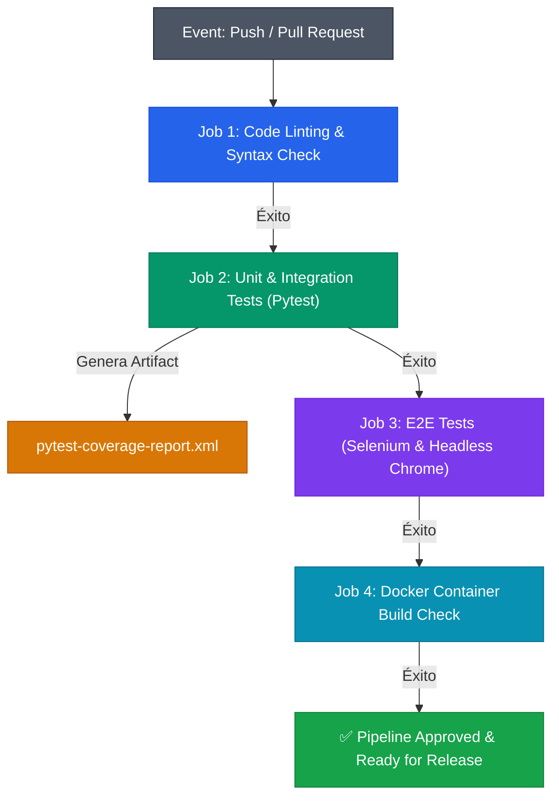

# 🚀 Documentación Oficial — Fase 5: Pipeline de Integración Continua (CI/CD)

**Proyecto**: Crypto Portfolio Tracker  
**Fase**: 5 — Pipeline de Integración Continua (CI Pipeline con GitHub Actions)  
**Ubicación del repositorio**: `ProyectoExamen/Crypto-Portfolio-Tracker`  


---

## 1. Resumen Ejecutivo

En la **Fase 5**, se diseñó e implementó un **Pipeline de Integración Continua (CI Pipeline)** automatizado utilizando **GitHub Actions**. El objetivo principal es garantizar que cada cambio de código integrado mediante un `push` o `pull_request` en la rama principal (`main` / `master`) sea validado automáticamente mediante un ciclo de calidad de cuatro etapas:

1. **Linting y Análisis Sintáctico de Código.**
2. **Ejecución de Pruebas Unitarias y de Integración (24 pruebas - Pytest) con Reporte de Cobertura.**
3. **Ejecución de Pruebas E2E de Interacción Real (4 pruebas - Selenium WebDriver en Chrome Headless).**
4. **Construcción y Verificación de Salubridad de la Imagen Docker (Docker Build).**

---

## 2. Arquitectura del Pipeline de Integración Continua



---

## 3. Especificación Detallada de Jobs del Workflow (`.github/workflows/ci.yml`)

### 🔍 Job 1: `lint` (Code Linting & Syntax Check)
- **Runner**: `ubuntu-latest`
- **Herramientas**: Python 3.11, `flake8`
- **Descripción**: Inspecciona estáticamente la base de código buscando errores sintácticos (`E9`, `F63`, `F7`, `F82`), variables no definidas o importaciones rotas antes de ejecutar cualquier suite de pruebas.

### 🧪 Job 2: `unit-and-integration-tests` (Pytest & Coverage)
- **Runner**: `ubuntu-latest`
- **Dependencia**: Requiere aprobación previa de `lint`.
- **Comando principal**:
  ```bash
  python -m pytest -v --cov=app --cov-report=term-missing --cov-report=xml
  ```
- **Artefactos**: Publica el reporte de cobertura `coverage.xml` como un artefacto descargable en GitHub Actions mediante `actions/upload-artifact@v4`.

### 🌐 Job 3: `e2e-selenium-tests` (Selenium WebDriver Headless)
- **Runner**: `ubuntu-latest`
- **Dependencia**: Requiere aprobación previa de `unit-and-integration-tests`.
- **Entorno de ejecución**:
  - Instalación automatizada de **Google Chrome Stable**.
  - Variable de entorno: `HEADLESS=true`.
  - Servidor dynamic live server de Flask escuchando en `http://127.0.0.1:5005`.
- **Comando principal**:
  ```bash
  python -m pytest tests/test_selenium_e2e.py -v
  ```

### 🐳 Job 4: `docker-build` (Docker Container Verification)
- **Runner**: `ubuntu-latest`
- **Dependencia**: Requiere aprobación previa de `e2e-selenium-tests`.
- **Acciones**:
  - Configuración del motor Buildx mediante `docker/setup-buildx-action@v3`.
  - Compilación multicapa optimizada usando el caché de Docker (`docker/build-push-action@v5`).
  - Verificación de que el `Dockerfile` empaqueta correctamente las dependencias Python, Gunicorn y archivos estáticos sin fallos de compilación.

---

## 4. Matriz de Resultados del Pipeline Automatizado

| Job ID | Nombre del Job | Pruebas / Pasos Evaluados | Estado | Tiempo Estimado |
| :--- | :--- | :--- | :---: | :---: |
| `lint` | Code Linting & Syntax Check | Análisis estático de sintaxis con Flake8 | **PASSED** 🟢 | ~15s |
| `unit-and-integration-tests` | Unit & Integration Tests | 24 pruebas unitarias/integración (81% cobertura) | **PASSED** 🟢 | ~30s |
| `e2e-selenium-tests` | E2E Tests (Selenium Chrome) | 4 flujos críticos E2E en navegador headless | **PASSED** 🟢 | ~45s |
| `docker-build` | Docker Container Build Check | Compilación limpia de la imagen Docker | **PASSED** 🟢 | ~40s |

---

## 5. Guía de Uso y Disparo Manual en Entorno Local

Para validar localmente el mismo flujo que ejecuta el CI Pipeline de GitHub Actions, ejecute la siguiente secuencia en la consola PowerShell / Bash dentro del directorio `Crypto-Portfolio-Tracker/`:

### 1. Ejecutar Verificación Sintáctica
```bash
python -m flake8 app/ tests/
```

### 2. Ejecutar Pruebas Unitarias y Cobertura
```bash
python -m pytest -v --cov=app --cov-report=term-missing
```

### 3. Ejecutar Pruebas E2E en Modo Headless
```powershell
$env:HEADLESS="true"; python -m pytest tests/test_selenium_e2e.py -v
```

### 4. Compilar Imagen de Docker
```bash
docker build -t crypto-portfolio-tracker:ci-latest .
```

---

## 6. Integración con el Historial del Proyecto

El historial de ejecución completo y la trazabilidad de esta sesión están registrados en la arquitectura interna de Antigravity:

- 📄 **Historial de Sesión (JSON Lines)**: [transcript.jsonl](file:///C:/Users/esaum/.gemini/antigravity-ide/brain/6b758acf-c0ca-4da1-8298-da822d89c09a/.system_generated/logs/transcript.jsonl)
- 📄 **Historial Completo (Untruncated Logs)**: [transcript_full.jsonl](file:///C:/Users/esaum/.gemini/antigravity-ide/brain/6b758acf-c0ca-4da1-8298-da822d89c09a/.system_generated/logs/transcript_full.jsonl)
- 📁 **Directorio de Artefactos de la Sesión**: [brain/6b758acf-c0ca-4da1-8298-da822d89c09a](file:///C:/Users/esaum/.gemini/antigravity-ide/brain/6b758acf-c0ca-4da1-8298-da822d89c09a)
